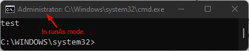

# PowerShell Class

A class that **generates a PowerShell command array**.

An **implementation of ICommandArray** from the module **[xyz.ronella.casual.trivial](https://github.com/rcw3bb/trivial-chunk)**.

This implementation can only be instantiated by the following builder class:

```java
PowerShell.PowerShellBuilder
```

This builder can only be  created by the following method:

```
PowerShell.getBuilder()
```

## Property

| Property | Description                                  |
| -------- | -------------------------------------------- |
| PROGRAM  | A constant that contains **powershell.exe**. |

## Methods

| Method                                                     | Description                                                  |
| ---------------------------------------------------------- | ------------------------------------------------------------ |
| public static String **encodeText**(final String **text**) | Encode the **text parameter to Base64**.                     |
| public static String **getValue**(final String **text**)   | Get the value of the **text parameter without any prefix** if available. |

## PowerShell Command Array Syntax

```
powershell.exe [PArg(s)] [Command] [Arg(s)|EncodedArg] [ZArg(s)]
```

## The PowerShell.PowerShellBuilder Class

This is the only class can can **create an instance of PowerShell**.

### Method Descriptions

| Method                | Description                                                  |
| --------------------- | ------------------------------------------------------------ |
| addAdminModeHeader    | When **AdminMode is true**, this will **add a statement before the AdminModeLogic**. |
| addArg/addArgs        | Add **argument(s) to the command**.                          |
| addEncodedArg         | Add **encoded argument to the command**.                     |
| addPArg/addPArgs      | Add **powershell argument(s)**.                              |
| addZArg/addZArgs      | Add **terminal argument(s) to the command**. <br />Use this if you want the argument(s) to be always after the command argument(s). |
| build                 | The only method that can **create the PowerShell instance**. |
| enableDefaultArgs     | Add the arguments **-NoProfile -InputFormat None -ExecutionPolicy Bypass** to the powershell.exe **when set to true**. |
| setAdminMode          | Request the builder to **create a command array that can be executed in runAs mode** when this method was **used and set to true**.<br />When **used and set to false**, the generated command array will be similar to the one generated when passing the true parameter except that the **command array generated doesn't have runAs**. |
| setAdminModeLogic     | Use this to **change the behavior of the admin mode command array generation**. <br /><br />Using this means you need to deal with the following yourself:<br />* Assembling the **command array in admin mode**.<br />* Assembling the **command array in non-admin mode**.<br />* Deal with **literal prefixed values**.<br /><br />Normally you need to pass a function with the following syntax: <br />```(isAdminMode, adminHeader, programArgs, command, commandArgs) -> {<ADMIN_MODE_LOGIC_HERE>}``` |
| setCommand            | The **command or external program to be executed** with powershell.exe. |
| setPreferNonAdminMode | Set this to true **when you prefer to generate non-runAs command array** even if you set the AdminMode to true. <br />This means, when your powershell.exe was **already running in runAs mode** *(e.g. elevated command prompt)* the builder will **not generate a command array for runAs execution**. |
| setRawArgs            | Request the builder to **process the arguments the way you passed it**. The builder will not add your unwanted quotations to the arguments to the generated command array as much as possible[^1]. <br /><br />This only affects args and zargs. |
| suppressProgramName   | If you **don't want to include the program name *(i.e. powershell.exe)*** in the generated command array, **set this to true**. |

### Method Signatures

| Method                                                       |
| ------------------------------------------------------------ |
| public PowerShellBuilder **addAdminHeader**(final BooleanSupplier **when**, final String **header**) |
| public PowerShellBuilder **addAdminHeader**(final String **header**) |
| public PowerShellBuilder **addAdminHeaders**(final BooleanSupplier **when**, final Collection<String> **headers**) |
| public PowerShellBuilder **addAdminHeaders**(final Collection<String> **headers**) |
| public PowerShellBuilder **addArg**(final BooleanSupplier **when**, final String **arg**) |
| public PowerShellBuilder **addArg**(final String **arg**)    |
| public PowerShellBuilder **addArgs**(final BooleanSupplier **when**, final Collection<String> **args**) |
| public PowerShellBuilder **addArgs**(final Collection<String> **args**) |
| public PowerShellBuilder **addEncodedArg**(final BooleanSupplier **when**, final String **arg**) |
| public PowerShellBuilder **addEncodedArg**(final String **arg**) |
| public PowerShellBuilder **addPArg**(final BooleanSupplier **when**, final String **arg**) |
| public PowerShellBuilder **addPArg**(final String **arg**)   |
| public PowerShellBuilder **addPArgs**(final BooleanSupplier **when**, final List<String> **args**) |
| public PowerShellBuilder **addZArg**(final BooleanSupplier **when**, final String **args**) |
| public PowerShellBuilder **addZArg**(final String **args**)  |
| public PowerShellBuilder **addZArgs**(final BooleanSupplier **when**, final Collection<String> **args**) |
| public PowerShellBuilder **addZArgs**(final Collection<String> **args**) |
| public PowerShell **build**()                                |
| public PowerShellBuilder **enableDefaultArgs**(final boolean **enable**) |
| public PowerShellBuilder **setAdminMode**(final boolean **isAdminMode**) |
| public PowerShellBuilder **setAdminModeLogic**(final IPSAdminModeLogic **adminLogic**) |
| public PowerShellBuilder **setCommand**(final BooleanSupplier **when**, final String **command**) |
| public PowerShellBuilder **setCommand**(final String **command**) |
| public PowerShellBuilder **setPreferNonAdminMode**(final boolean **prefNonAdminMode**) |
| public PowerShellBuilder **setRawArgs**(final boolean **raw**) |
| public PowerShellBuilder **suppressProgramName**(final boolean **suppress**) |

#### Parameters

| Parameter        | Description                                                  |
| ---------------- | ------------------------------------------------------------ |
| adminLogic       | Must accept an implementation of IPSAdminModeLogic functional interface.<br /><br />*See more in setAdminModeLogic in Method Descriptions section.* |
| arg              | The argument to be added.                                    |
| args             | The collection of arguments to be added.                     |
| command          | The command for the program.                                 |
| enable           | *See enableDefaultArgs in Method Descriptions section.*      |
| isAdminMode      | *See setAdminMode in Method Descriptions section.*           |
| header           | The header to be added.                                      |
| headers          | The collection of headers to be added.                       |
| prefNonAdminMode | *See setPreferNonAdminMode in Method Descriptions section.*  |
| program          | The program to execute.                                      |
| raw              | *See setRawArgs in Method Descriptions section.*             |
| suppress         | *See suppressProgramName in Method Descriptions section.*    |
| when             | The logic to must return true for the argument(s) to be added. |

### The Literal Prefix

The literal prefix is **like a setRawArgs *(i.e. applied to all the arguments)* but it is more refine**. You can just use the literal prefix to **just the argument(s) you wanted to be treated as literal**. Another difference with setRawArgs is that you can also **use it with setCommand**.

#### Syntax

```
literal:<value>
```

**Example**

If you want to make the **cmd** as the **setCommand argument** and instructing the PowerShellBuilder to **not place any quote as much as possible** [^1], you can do the following:

```java
builder.setCommand("literal:cmd")
```

## Sample Usage

### Command to display the powershell help

```java
var ps = PowerShell.getBuilder()
        .setCommand("-Help")
        .build();

System.out.println(String.join(" ", ps.getCommand()));
```

**Expected Output**

```
powershell.exe "-Help"
```

### Running cmd /k "echo test" in runAs mode

```java
var ps = PowerShell.getBuilder()
        .setCommand("literal:cmd")
        .addArgs(List.of("'/k'", "literal:'echo test'"))
        .setAdminMode(true)
        .build();

System.out.println(String.join(" ", ps.getCommand()));
```

**Expected Output**

```
powershell.exe -EncodedCommand RQB4AGkAdAAgACgAUwB0AGEAcgB0AC0AUAByAG8AYwBlAHMAcwAgACIAYwBtAGQAIgAgAC0AVwBhAGkAdAAgAC0AUABhAHMAcwBUAGgAcgB1ACAALQBWAGUAcgBiACAAUgB1AG4AQQBzACAALQBhAHIAZwB1AG0AZQBuAHQAbABpAHMAdAAgACcALwBrACcALAAnAGUAYwBoAG8AIAB0AGUAcwB0ACcAKQAuAEUAeABpAHQAQwBvAGQAZQA=
```

> If you try paste the **output in command prompt** expect to see a powershell dialog the **cmd is running in runAs mode**.
>
> 

### Custom admin mode logic

```java
var ps = PowerShell.getBuilder()
        .setCommand("literal:cmd")
        .addArgs(List.of("literal:/k", "literal:'echo test'"))
        .setAdminMode(true)
        .setAdminModeLogic((___isAdminMode, ___admHeader, ___progArgs, ___command, ___commandArgs) -> {
            final var sbArgs = new StringBuilder();
            final var appenderArgs = new StringBuilderAppender(sbArgs);
            ___commandArgs.forEach(___arg -> {
                appenderArgs.append(() -> sbArgs.length() > 0, ",");
                appenderArgs.append(___arg.startsWith("literal:")
                        ? PowerShell.getValue(___arg)
                        : String.format("\"\"\"%s\"\"\"", ___arg));
            });
            final var adminCommand = String.format("Exit (Start-Process %s -Wait -PassThru%s%s%s).ExitCode",
                    PowerShell.getValue(___command), ___isAdminMode ? " -Verb RunAs": "",
                    sbArgs.length() == 0 ? "" : " -argumentlist ", sbArgs);
            final var argsAdder = new ListAdder<>(___progArgs);
            argsAdder.add("-EncodedCommand");
            final var sbAdminCommand = new StringBuilder();
            ___admHeader.stream().map(___header -> ___header + "\n").forEach(sbAdminCommand::append);
            sbAdminCommand.append(adminCommand);
            return PowerShell.encodeText(sbAdminCommand.toString());
        })
        .build();

System.out.println(String.join(" ", ps.getCommand()));
```

**Expected Output**

```
powershell.exe -EncodedCommand RQB4AGkAdAAgACgAUwB0AGEAcgB0AC0AUAByAG8AYwBlAHMAcwAgAGMAbQBkACAALQBXAGEAaQB0ACAALQBQAGEAcwBzAFQAaAByAHUAIAAtAFYAZQByAGIAIABSAHUAbgBBAHMAIAAtAGEAcgBnAHUAbQBlAG4AdABsAGkAcwB0ACAALwBrACwAJwBlAGMAaABvACAAdABlAHMAdAAnACkALgBFAHgAaQB0AEMAbwBkAGUA
```
> If you try paste the **output in command prompt** expect to see a powershell dialog the **cmd is running in runAs mode**.
>
> 

[Table of Contents](USER_GUIDE_TOC.md)

------
[^1]:The default adminModeLogic is always requiring the cmd to be double quoted. This is necessary for the command with spaces in between *(i.e. specially commands with pull path)*. 